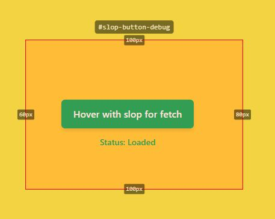

# React Hover Slop

[](https://www.npmjs.com/package/react-hover-slop)
[](https://www.npmjs.com/package/react-hover-slop)
[](https://www.npmjs.com/package/react-hover-slop)
[](https://opensource.org/licenses/MIT)

A React hook that expands the area of the mouseOver, mouseLeave and mouseEnter events for React components. Useful for if you want to prefetch earlier than regular hover.

## [Live Demo](https://react-hover-slop-example-page.vercel.app/)

## Installation

```bash
npm install react-hover-slop
# or
yarn add react-hover-slop
# or
pnpm add react-hover-slop
```

## Why React Hover Slop?

- Predictive Intent: Detects user intent before they actually hover over an element
- Early Data Fetching: Pre-fetch data when users approach elements, reducing perceived loading times

## Usage

```jsx
import { useRef } from "react"
import useHoverslop from "react-hover-slop"

function MyComponent() {
  const buttonRef = useRef(null)

  const { isHovered } = useHoverslop(
    buttonRef,
    { top: 20, right: 20, bottom: 20, left: 20 }, // Extend hover hitbox 20px in all directions
    {
      onMouseEnter: () => console.log("Mouse entered extended area"),
      onMouseLeave: () => console.log("Mouse left extended area"),
    },
    {
      debugMode: false, // Optional debugging
    }
  )

  return (
    <button
      ref={buttonRef}
      style={{
        backgroundColor: isHovered ? "blue" : "gray",
        transition: "background-color 0.3s",
      }}
    >
      Hover Me
    </button>
  )
}
```

## API

### `useHoverslop(elementRef, hoverslopBox, mouseEvents, options?)`

#### Parameters

- `elementRef`: React ref to the target element
- `hoverslopBox`: Either a number (applies to all sides) or an object with optional `top`, `right`, `bottom`, and `left` properties
- `mouseEvents`: Object containing optional callback functions:
  - `onMouseEnter`: Called when the cursor enters the extended area
  - `onMouseOver`: Called repeatedly while the cursor is in the extended area
  - `onMouseLeave`: Called when the cursor leaves the extended area
- `options`: Object containing optional configuration:
  - `debugMode`: Boolean to enable visual debugging of hover areas
  - `eventOptions`: Object to control event behavior:
    - `onMouseEnter`: Object with options for mouse enter event:
      - `once`: Boolean to fire event only once
    - `onMouseLeave`: Object with options for mouse leave event:
      - `once`: Boolean to fire event only once

#### Returns

- `isHovered`: Boolean indicating whether the cursor is within the extended area

## Visual Debugging

Adds a visual border around the element for debugging your slop boxes.

 

## Changelog

For a detailed list of changes between versions, see the [CHANGELOG](https://github.com/yourusername/react-hover-slop/blob/main/CHANGELOG.md).

## License

MIT
